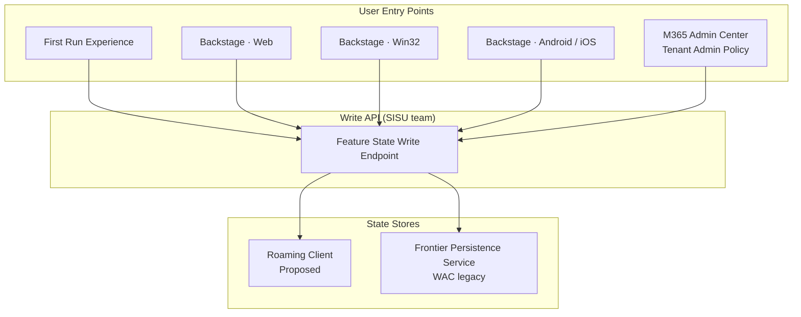
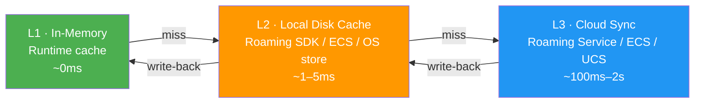
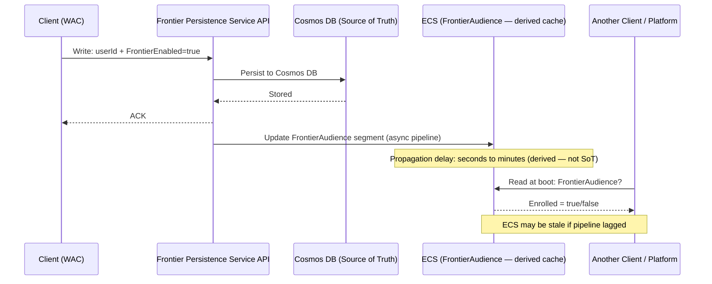
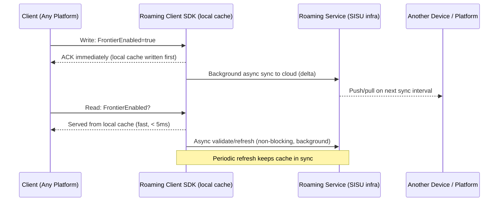
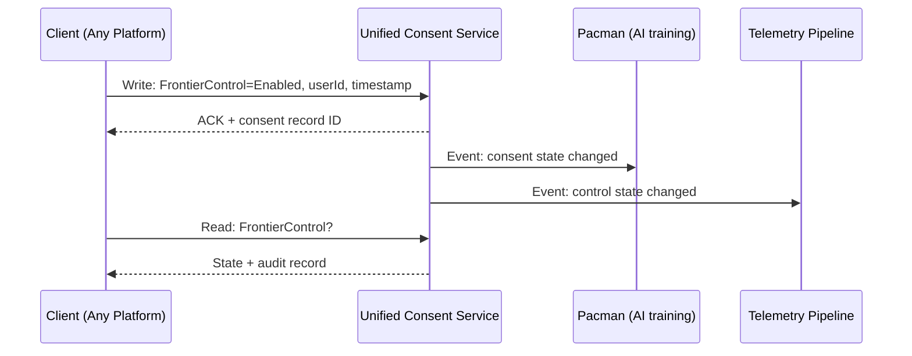
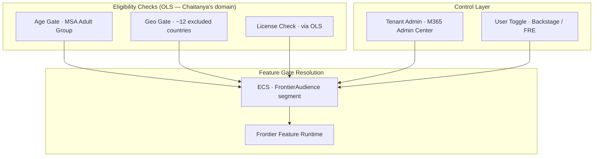
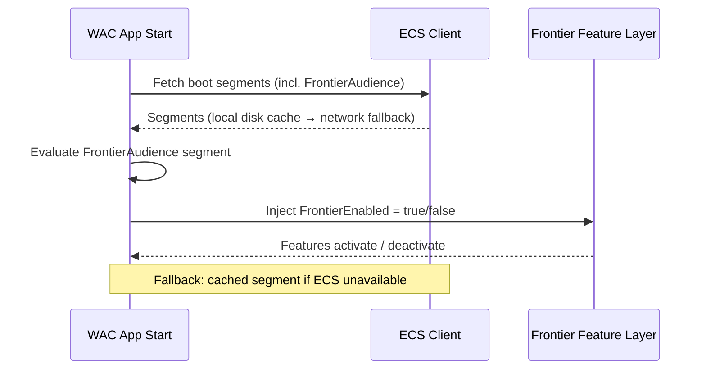
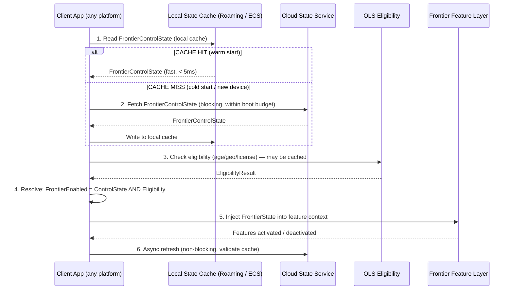
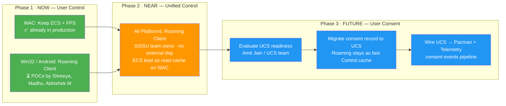
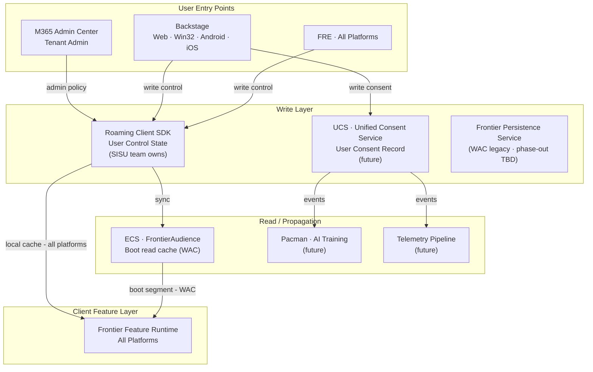

# Frontier Feature — User Control & Consent State Management
## Engineering Comparative Analysis — v2.0

> **Status:** Draft v2.0 — Updated: 2026-05-11 (incorporates SSC Sync Internal meeting transcript + notes, May 8 2026)
> **Supersedes:** `Frontier_Consent_Storage_Comparison.md` v0.1 (2026-05-08)
> **Author:** Abhishek Bag (abbag)
> **Reviewers:** Sridhar Dantuluri, T Madhu Kumar, Shreeya Singh, Chaitanya Gogineni, Gabrielle Stadlen
> **Action items from:** SSC Sync Internal — May 8 2026; Sridhar Dantuluri review comments — May 11 2026

---

## 🔑 Key Insights from May 8, 2026 SSC Sync Internal Meeting

> The following critical clarifications emerged from the recorded team discussion (Abhishek Bag, T Madhu Kumar, Shreeya Singh, Abhishek Malviya). These update the v0.1 framing significantly.

| # | Insight | Impact on Document |
|---|---------|-------------------|
| **1** | **ECS ≠ User Preferences Store.** Shreeya clarified: ECS is for *feature ring/ring-based rollout* (provisioning Microsoft-controlled feature gates), NOT for storing user opt-in preferences. Storing Frontier enrollment state in ECS is a conceptual misuse. | Updates §4 Option A framing |
| **2** | **Cosmos DB is the actual Source of Truth.** Real architecture: Client → Persistence API → **Cosmos DB** (SoT) → pipeline → ECS (derived read cache). ECS is NOT the source of truth. | Updates §4 architecture diagrams |
| **3** | **UCS has NO client-side cache.** Server-side caching only. Boot-time requires a network call. SLA ~50ms typical, ~100ms worst case — Madhu confirmed this is acceptable. | Updates §4 Option C, §6 boot table |
| **4** | **Roaming writes local cache first, then syncs to cloud.** Correct write flow: write to local cache immediately → background async sync to Roaming Service. Writes feel instantaneous on-device. | Updates §4 Option B sequence diagram |
| **5** | **Privacy concern (Sridhar) on ECS token/local cache.** Sridhar raised privacy concerns about token handling and local device caching with the ECS approach. Team to clarify with Sridhar this weekend. | New open question added |
| **6** | **Android Roaming = JNI bridge (Java → C++).** No SDK/contract yet. Building JNI (Java Native Interface) needed to call Roaming C++ code from Android Java. Estimated effort: **2–4 weeks**. | Updates §3 Android row |
| **7** | **Decision direction is clear:** Roaming Client for enrollment (User Control). UCS only if future consent requirements demand it. | Updates §7 recommendation |
| **8** | **Separate comparison matrices needed.** v0.1 matrix only covered consent storage. Need separate matrices for (a) enrollment/control and (b) future consent. | New §8A and §8B matrices added |
| **9** | **~30-day cache cool-off period under discussion.** Sridhar and PMs discussing ~30-day cache expiration for enrollment state in C-light sims. | New note in §3 |
| **10** | **Commercial admin controls absent from both UCS and Roaming.** Neither system currently exposes tenant admin policy controls — confirmed open gap. | Adds clarity to §5 |

---

## Executive Summary

This document is an expanded engineering analysis of the Frontier feature state management challenge. It covers **two distinct but closely related concerns**, analyzed across **five engineering dimensions** proposed by Sridhar Dantuluri:

| # | Scope | Timeline | Objective |
|---|-------|----------|-----------|
| **1** | **User Control Management** | **Current** | Store and retrieve whether Frontier is enabled for a user/tenant. Fast, reliable, cross-platform. Changed by user opt-in/opt-out and admin policy. |
| **2** | **User Consent Management** | **Future** | Store the user's explicit consent for Frontier data collection. Share consent record with downstream systems (Pacman/AI training, telemetry for adoption analytics). |

Three candidate systems are evaluated:

| System | Owner | Status |
|--------|-------|--------|
| **A: ECS + Frontier Persistence Service (FPS)** | Elie Aoun (eaoun) | ✅ Production on WAC |
| **B: Roaming Client** (SISU/SSC team) | Sridhar Dantuluri's team | ⏳ POCs in progress (Win32, Android, Web) |
| **C: UCS — Unified Consent Service** | UCS team (Amit Jain) | ❓ Under investigation (ADO #11445677) |

**Key Takeaway:**
- **Near-term (User Control):** Keep ECS + FPS for WAC (already in production). Adopt **Roaming Client** for Win32/Android/iOS — SISU team owns it, POCs active, no external dependency.
- **Long-term (User Consent + Unified):** Evaluate **UCS** as the single platform. It is purpose-built for consent records, natively supports downstream (Pacman, telemetry), and provides audit/compliance. Roaming Client can remain the fast-read local cache layer while UCS becomes the consent source of truth.

> **Section 4 (Commercial Flow)** is a placeholder — awaiting input from **Chaitanya Gogineni (chgogine@microsoft.com)** who is helping with the OLS/licensing side.

---

## 1. Background

### 1.1 What is Frontier?

Frontier is a Microsoft 365 opt-in program that allows consenting users to share usage data for AI model improvements. Before a user participates, three gates must pass:

1. **Eligibility** — Age gate (MSA "Adult" group), geo gate (~12 excluded countries), license check via OLS.
2. **User Control** — Is the feature enabled for this user/tenant? (admin and user toggles)
3. **User Consent** — Did the user explicitly consent to data collection? (per CELA/GDPR guidance)

> This document focuses primarily on **#2 (User Control)** as the current engineering goal, with explicit architectural consideration for **#3 (User Consent)** to ensure the chosen approach does not create a dead end.

### 1.2 Scope Definitions

#### User Control Management (Current Goal)
> *"Is Frontier enabled for this user, and how do we store and retrieve that state — fast, reliably, and at scale?"*

This is a **feature flag / feature gate** problem:
- **Who changes it:** Admin (tenant-level policy via M365 Admin Center) or end user (opt-in/out via Backstage or FRE)
- **When it is read:** First Run Experience (FRE), app boot, normal access (feature check gates)
- **Critical properties:** Fast local read (< boot latency budget), reliable cross-device sync, cross-platform

#### User Consent Management (Future Goal)
> *"Did the user consent to Frontier data collection, and how do we share that legal record with downstream systems?"*

This is a **consent record** problem (legally distinct from the feature gate):
- **Who changes it:** End user (explicit grant or revoke) per CELA/privacy guidance
- **Shared with:** Pacman (AI training pipeline outside current scope), telemetry pipeline for adoption analytics
- **Critical properties:** Audit trail with timestamp and actor, GDPR-compliant, purpose-separated from feature state

### 1.3 Candidate Systems

| System | Owner | Current Usage | Cross-Platform |
|--------|-------|--------------|----------------|
| **A: ECS + FPS** | Elie Aoun (eaoun) | Production on WAC | WAC only |
| **B: Roaming Client** | Sridhar Dantuluri / SISU | Production (general settings); POCs for Frontier | POCs for Win32, Android, Web |
| **C: UCS** | UCS team / Amit Jain | Not yet adopted for Frontier | API-based; any platform |

---

## 2. Section 1 — Platform Experience

> *"Experience in different platforms and how we can build (options and proposed + any reasons why etc)"* — Sridhar

### 2.1 Platform Overview

Frontier enrollment surfaces in **Backstage** across platforms. A key challenge raised by Madhu Kumar (May 5, 2026): *"Frontier enrollment in Backstage — the experience is not the same on all platforms currently. Web, Win32 and mobile all have a different experience for Backstage and different code that powers these experiences."*

Sim-ship is about Frontier **features** shipping to all platforms simultaneously — the enrollment capability does not need to be identical across platforms on day 1.

| Platform | Backstage Implementation | Frontier State Today | POC Owner | Sim-ship Ready? |
|----------|------------------------|---------------------|-----------|----------------|
| **WAC (Web)** | `ooui` / React, `IRoamingSettingCache` | ✅ Production (ECS + FPS) | — | ✅ Yes |
| **Win32** | Native Win32 (separate codebase) | ❌ Not yet | Shreeya Singh + Abhishek Malviya | ⚠️ POC |
| **Android** | Android-specific Backstage | ❌ Not yet | T Madhu Kumar | ⚠️ POC |
| **iOS** | iOS-specific Backstage | ❌ Not started | TBD | ❌ No |

### 2.2 Enrollment UX Options

| Option | Description | Pros | Cons | Verdict |
|--------|-------------|------|------|---------|
| **1: Backstage-embedded** | Frontier toggle inside Backstage on each platform | Consistent discoverability; aligns with WAC production | Per-platform implementation effort | ✅ **Proposed for all platforms** |
| **2: WAC-first, others read** | Enrollment on WAC; Win32/Mobile read state set on web | Fast WAC unblocking | Poor mobile/Win32 UX; requires reliable cross-device sync from day 1 | ⚠️ Interim only |
| **3: FRE-only enrollment** | Frontier shown only during First Run Experience | Natural discovery moment | No change-later UX; FRE varies per platform | ❌ Not standalone |

### 2.3 Platform Enrollment Architecture

---

## 3. Section 2 — State / Client Persistence

> *"State/Client persistence (locally on client and cache, what options and proposed again)"* — Sridhar

Local persistence ensures Frontier state is available **without a network call** — critical for fast boot and offline/degraded-network scenarios.

### 3.1 Local Persistence Options by Platform

| Option | Platform | Mechanism | Read Speed | Write Complexity | Cross-Device | Recommended |
|--------|----------|-----------|------------|-----------------|--------------|-------------|
| **ECS Local Cache** | WAC, Win32 | ECS client disk cache | Fast | Low (read-only from client) | No (derived from server) | ⚠️ WAC fallback |
| **Roaming Local Cache** (`IRoamingSettingCache`) | WAC today; Win32/Mobile POC | In-memory + local persistence via Roaming SDK | Fast | Low (SDK handles) | ✅ Yes (via Roaming Service) | ✅ **Proposed** |
| **Office Data Layer / Registry** | Win32 | Win32 prefs / Registry | Fast | Medium | No (local only) | ⚠️ Fallback if Roaming POC fails |
| **SharedPreferences / Keychain** | Android / iOS | OS-level secure storage | Fast | Low | No (per-device) | ⚠️ Fallback if Roaming POC fails |
| **IndexedDB / LocalStorage** | WAC | Browser storage | Fast | Low | No (per-browser) | ❌ Not persistent across devices |
| **UCS Client SDK Cache** | All (future) | SDK-level local cache | TBD | TBD | Yes (via UCS) | ❓ Pending SDK evaluation |

### 3.2 Cache Read Hierarchy (Proposed)

**Behavior by scenario:**

| Scenario | L1 | L2 | Action | Latency Impact |
|----------|----|----|--------|----------------|
| **Warm start (returning user)** | Miss | HIT | Serve from L2; async refresh L3 | Minimal — fast local read |
| **Cold start (first install / new device)** | Miss | Miss | Blocking fetch from L3; write to L2+L1 | Visible — within boot timeout budget |
| **State change (user toggles)** | Invalidate | Invalidate | Write to L3 immediately; next read picks up | Near-real-time after sync |

### 3.3 Persistence Readiness by Platform

| Platform | Roaming Client | ECS Cache | OS-Native Store | Recommended Path |
|----------|---------------|-----------|-----------------|-----------------|
| **WAC** | ✅ (`IRoamingSettingCache`) | ✅ (production) | — | Roaming Client |
| **Win32** | ⚠️ POC (Shreeya + Abhishek M) | ✅ Config client | ✅ Registry/Prefs | Roaming Client (post-POC) |
| **Android** | ⚠️ POC (Madhu) — **JNI bridge required** (Java → C++), ~2–4 weeks | ❌ | ✅ SharedPreferences | Roaming Client (post-JNI, post-POC) |
| **iOS** | ❌ Not started | ❌ | ✅ Keychain | Roaming Client (post-POC) |

---

## 4. Section 3 — State Synchronization (to Cloud)

> *"State synchronization (to cloud, what options and proposed again)"* — Sridhar

Cloud sync ensures that when a user changes their Frontier setting on one device/platform, all other devices reflect that change consistently and in a timely manner.

### 4.1 Option A — ECS + Frontier Persistence Service

> ⚠️ **Conceptual note (from meeting):** ECS is designed for Microsoft-controlled **feature ring rollout** (e.g., gradually enabling a feature for 1% → 10% → 100% of users in rings). It is **not designed** to store user opt-in preferences. While the current WAC implementation routes Frontier enrollment through ECS, this is architecturally a misuse of ECS. The real source of truth is **Cosmos DB** (via the Frontier Persistence Service API) — ECS merely serves as a derived read cache.

**Characteristics:**
| Attribute | Value |
|-----------|-------|
| Actual source of truth | **Cosmos DB** (via Frontier Persistence Service) |
| Write path | Client → FPS API → Cosmos DB → async pipeline → ECS (two hops, async) |
| Read path | ECS segment pull at boot (derived cache, not SoT) |
| Conceptual fit | ⚠️ ECS is for feature gating, not user preferences — conceptual mismatch |
| Propagation latency | Seconds–minutes (ECS async pipeline) |
| Cross-platform | WAC only; other platforms require Elie's team + backend scaling |
| Privacy concerns | ⚠️ Sridhar raised token handling / local cache privacy concerns (TBD) |
| ECS expansion | Backend scaling needed for non-WAC platforms (not just client changes) |
| SISU ownership | ❌ External (Elie Aoun's team) |

### 4.2 Option B — Roaming Client (SISU/SSC Team)

**Characteristics:**
| Attribute | Value |
|-----------|-------|
| Write path | Client → Roaming SDK (local cache first, then background sync to service) |
| Read path | Local Roaming cache (fast, < 5ms); async background refresh from service |
| Write latency | Instantaneous from client perspective (local cache write + background cloud sync) |
| Propagation latency | Near-real-time (delta sync to other devices after background upload) |
| Cross-platform | Designed for it; Win32+Android POCs; iOS not started |
| Cache expiration | ~30-day cool-off period under discussion (Sridhar + PMs, C-light sims) |
| Downstream integration | ⚠️ Open question: can Roaming push to external services? |
| Android integration | JNI (Java Native Interface) needed to call C++ Roaming code — 2–4 weeks effort |
| SISU ownership | ✅ Fully owned by SISU/SSC team |

### 4.3 Option C — UCS (Unified Consent Service)

**Characteristics:**
| Attribute | Value |
|-----------|-------|
| Write path | Client → UCS API (single hop, synchronous) |
| Read path | UCS API call — **no client-side cache** (server-side caching only) |
| Boot-time requirement | ⚠️ Network call required at every boot — no local cache |
| API response SLA | ~50ms typical, ~100ms worst case (Madhu confirmed acceptable) |
| Cross-platform | Any platform via API/SDK |
| Tenant admin controls | ❌ Not currently supported — open gap |
| Downstream integration | ✅ Native webhooks/events to Pacman, telemetry |
| SISU ownership | ❌ External (UCS team) |

### 4.4 Sync Mechanism Comparison

| Criterion | ECS + FPS | Roaming Client | UCS |
|-----------|-----------|----------------|-----|
| **Actual source of truth** | Cosmos DB (FPS) | Roaming Service | UCS service |
| **ECS role** | Derived read cache (NOT SoT) | N/A | N/A |
| **Write latency** | Low (FPS ACK fast; Cosmos async) | **Instantaneous** (local cache first, then background sync) | Low (direct API ~50ms) |
| **Cross-device propagation** | Seconds–minutes (ECS pipeline async) | Near-real-time (background delta sync) | Near-real-time |
| **Read latency** | Fast (ECS cached segment) | **Fastest** (local cache, < 5ms) | Medium (~50ms network call) |
| **Local client cache** | ✅ ECS local cache | ✅ Roaming local cache | ❌ No client cache — network call always |
| **Boot-time (cold start)** | ECS fetch from network | Roaming Service fetch → cache write | Network call to UCS (~50ms SLA) |
| **Boot-time (warm start)** | ECS local cache (fast) | Roaming local cache (fastest) | Network call to UCS (~50ms SLA) |
| **Offline support** | Partial (stale ECS cache) | ✅ Local cache survives offline (write queued) | ❌ Network required for reads |
| **Cache expiration** | ECS TTL | ~30-day cool-off (under discussion) | Server-side only |
| **Cross-platform today** | WAC only | WAC + POCs (Win32, Android) | Any (API-based) |
| **Downstream integration** | ❌ Custom pipelines needed | ⚠️ Investigate push capability | ✅ Native events |
| **Conceptual fit for user prefs** | ❌ ECS is for feature gating, not user settings | ✅ Purpose-built for settings/prefs | ✅ Purpose-built for consent/control |
| **Tenant admin controls** | ⚠️ Partial (via ECS) | ❌ Not currently exposed | ❌ Not currently exposed |
| **Privacy (token/cache)** | ⚠️ Sridhar raised concerns — TBD | ✅ Local cache managed by SDK | ✅ Server-side, no local token concern |
| **SISU team ownership** | ❌ External (Elie's team) | ✅ Fully owned | ❌ External (UCS team) |

---

## 5. Section 4 — Commercial Flow

> *"Commercial flow (how we read state, something Chaitanya is helping but lets have a section for him to add details)"* — Sridhar

> ⚠️ **[Section owner: Chaitanya Gogineni (chgogine@microsoft.com) — to be completed]**
> Sridhar has requested Chaitanya add the OLS/licensing eligibility details here.

### 5.1 Current Eligibility & Commercial Stack

### 5.2 Known Gaps in Commercial Flow

| Gap | Impact | Owner |
|-----|--------|-------|
| Tenant admin control not fully implemented | No org-level override available today | Gabrielle Stadlen / Sangeetha |
| OLS licensing check not wired to state store for Native/Mobile | License gate may not be enforced on Win32/Android | Chaitanya Gogineni |
| State read path for Win32/Android undefined | Unknown how features read resolved state at runtime | Madhu Kumar / Shreeya Singh |

### 5.3 Proposed Commercial Read Path (per platform)

| Platform | Reads State From | At Boot | At Runtime Feature Check |
|----------|-----------------|---------|--------------------------|
| **WAC** | ECS `FrontierAudience` | ✅ Yes (production) | ECS segment inline |
| **Win32** | TBD — Config client? Roaming? | ❓ | ❓ — **Chaitanya to clarify** |
| **Android** | TBD — Roaming? OLS direct API? | ❓ | ❓ — **Chaitanya to clarify** |
| **iOS** | TBD | ❓ | ❓ — **Chaitanya to clarify** |

---

## 6. Section 5 — Boot Flow & Feature Consumption

> *"How will client app make this state available? How will frontier features consume this state in the boot flow (and how it's different from today in web and win32)"* — Sridhar

### 6.1 Today's Boot Flow

#### WAC (Web App Client) — Today

#### Win32 — Today

- Win32 uses a **different configuration client** (not the same ECS client as WAC)
- Frontier feature state is **not yet wired into the Win32 boot path**
- Config client pulls configuration at startup but Frontier state is absent
- No local Frontier state cache on Win32 today

### 6.2 Proposed Boot Flow (Target State — All Platforms)

### 6.3 Boot Flow: Today vs Proposed

| Dimension | WAC Today | WAC Proposed | Win32 Today | Win32 Proposed | Android / iOS Proposed |
|-----------|-----------|--------------|-------------|----------------|------------------------|
| **State source** | ECS `FrontierAudience` | Roaming cache + ECS fallback | N/A (not implemented) | Roaming cache | Roaming cache |
| **Cold start behavior** | ECS network fetch | Roaming Service fetch → cache | N/A | Roaming Service fetch → cache | Roaming Service fetch → cache |
| **Warm start behavior** | ECS local disk cache | Roaming local cache (< 5ms) | N/A | Roaming local cache | Roaming local cache |
| **Feature injection point** | Boot segment evaluation | Boot segment / Roaming callback | N/A | Config client hook (TBD) | App lifecycle hook (TBD) |
| **Admin override propagation** | ECS segment update (async) | Roaming + admin policy layer | N/A | Admin policy layer | Admin policy layer |
| **Latency on warm start** | ~ECS cache read | ~Roaming local read (faster) | N/A | ~Roaming local read | ~Roaming local read |
| **Dependency** | ECS availability | Roaming SDK (local-first) | N/A | Roaming SDK | Roaming SDK |

### 6.4 Key Architectural Difference: ECS vs Roaming for Boot

| Aspect | ECS Approach (today/WAC) | Roaming Client Approach (proposed) |
|--------|--------------------------|-------------------------------------|
| Client writes | To Frontier Persistence Service → ECS async | Directly via Roaming Client SDK |
| Client reads | ECS segment (pull from server/cache) | Roaming local cache (push/pull hybrid) |
| Update propagation | ECS segment refresh cycle | Roaming delta sync (near-real-time) |
| Boot dependency | ECS availability required | Local cache first — no boot dependency |
| New platform effort | High (needs Elie's team per platform) | Medium (single Roaming SDK) |
| Admin override flow | ECS segment update | Admin policy via Roaming + policy layer |

---

## 7. Dual-Goal Analysis: User Control → User Consent

### 7.1 Transition Path Assessment

*"How fast can we move/adapt to User Consent Management if we adopt approach X for User Control Management now?"*

| Dimension | ECS + FPS | Roaming Client | UCS |
|-----------|-----------|----------------|-----|
| **Migration effort: Control → Consent** | 🔴 High — FPS is Frontier-specific; must build separate consent layer | 🟡 Medium — Roaming can store signal; add compliance layer for legal consent | 🟢 Low — UCS designed for both; same system, different record type |
| **Consent audit trail** | ❌ Not native; must add | ❌ Not native; must add | ✅ Built-in |
| **GDPR / CELA compliance** | ❌ Must layer on top | ❌ Must layer on top | ✅ Purpose-built |
| **Downstream sharing (Pacman, telemetry)** | ❌ Custom pipelines | ⚠️ Possible if push capability confirmed | ✅ Native events/webhooks |
| **Timeline to consent capability** | Long (major rework of FPS + ECS) | Medium (add consent layer to Roaming) | Short (add consent record type to UCS) |
| **Future extensibility (other M365 consents)** | ❌ Frontier-specific only | ⚠️ General settings, not multi-consent | ✅ Designed for multi-consent |

### 7.2 Recommended Phased Approach

### 7.3 System Fitness Summary

| System | User Control (Current) | User Consent (Future) | Overall Fit |
|--------|------------------------|----------------------|-------------|
| **ECS + FPS** | ✅ Good (WAC) | ❌ Poor (not designed for consent) | ⭐⭐ Near-term WAC only |
| **Roaming Client** | ✅ Good (all platforms after POCs) | ⚠️ Possible with extensions | ⭐⭐⭐ Best current-fit |
| **UCS** | ⚠️ Capable (API-based; pending onboarding) | ✅ Excellent (purpose-built) | ⭐⭐⭐⭐ Best long-term fit |

---

## 8. Full Comparison Matrix

| Criterion | **ECS + Frontier Persistence Service** | **Roaming Client (SISU Team)** | **UCS (Unified Consent Service)** |
|-----------|---------------------------------------|--------------------------------|-----------------------------------|
| **Purpose-fit for feature control** | ⚠️ Frontier-specific; not general | ✅ General settings roaming | ✅ Control + consent signals |
| **Purpose-fit for consent** | ❌ Not designed for consent records | ⚠️ Can store signal; not legal record | ✅ Designed for consent management |
| **Cross-platform (WAC, Win32, Android, iOS)** | WAC only today | ✅ Designed; POCs active | ✅ API-based; any platform |
| **Local cache / fast read** | ✅ ECS local cache | ✅ Roaming local cache | ⚠️ TBD (SDK cache) |
| **Boot-time performance** | ✅ ECS segment fast | ✅ Local cache fast (cold-start gap) | ⚠️ Network required unless cached |
| **Write path complexity** | Medium (client → FPS → ECS async) | Low (client → Roaming SDK) | Low (client → UCS API) |
| **Tenant admin / org control** | ⚠️ Partial | ⚠️ Per-user only natively | ✅ Policy support |
| **Audit trail / compliance** | ⚠️ Moderate | ❌ None | ✅ Full (timestamp, actor, version) |
| **GDPR / CELA alignment** | ⚠️ Must add layer | ⚠️ Must add layer | ✅ Built-in |
| **Downstream integration (Pacman, telemetry)** | ❌ Custom pipelines | ⚠️ Investigate push capability | ✅ Native events |
| **SISU team ownership** | ❌ External (Elie's team) | ✅ Fully owned | ❌ External (UCS team) |
| **Current production maturity** | ✅ WAC production | ⚠️ POCs in progress | ❓ Under investigation |
| **Time-to-market (Control)** | ✅ Fast (WAC) · 🔴 Slow (other platforms) | 🟡 Medium (post-POC validation) | 🔴 Slow (pending API onboarding) |
| **Control → Consent migration** | 🔴 High effort | 🟡 Medium effort | 🟢 Low effort |
| **Scalability** | ✅ M365 scale | ✅ M365 scale | ✅ Service-scale |
| **Test / override support** | ✅ `ForcedCopilotFrontier` URL param; PPE auth issues being resolved | ⚠️ Dogfood/preauth issues seen (Apr 2026) | ❓ TBD |
| **Cost** | ❓ TBD — ongoing FPS running cost | ❓ TBD — Roaming scale cost (Sangeetha) | ❓ TBD — SWAG in progress |

---

## 9. Proposed Final Architecture

---

## 10. Recommendation

> ⚠️ *Draft — to be validated with Sridhar, Madhu, Shreeya, Gabrielle, and Chaitanya at the next SSC Sync.*

### Near-term (User Control Management)

| Priority | Platform | Action | Owner |
|----------|----------|--------|-------|
| 1 | **WAC** | Keep ECS + FPS (production — no change) | Elie Aoun |
| 2 | **Win32** | Complete Roaming Client POC; validate boot-time read | Shreeya + Abhishek Malviya |
| 3 | **Android** | Complete Roaming Client POC | T Madhu Kumar |
| 4 | **All** | Define admin/tenant control flow; close gap | Gabrielle + Sangeetha + Chaitanya |
| 5 | **iOS** | Begin Roaming Client POC (after Win32/Android) | TBD |

### Long-term (User Consent Management + Convergence)

| Priority | Action | Owner |
|----------|--------|-------|
| 6 | Engage UCS team — API contract, onboarding timeline, MSA+AAD support | Amit Jain / UCS team |
| 7 | Evaluate ECS + FPS deprecation on WAC once Roaming is stable | Elie Aoun + Sridhar |
| 8 | Plan consent record migration to UCS; Roaming stays as Control cache | Sridhar + Abhishek |
| 9 | Wire UCS → Pacman + Telemetry pipeline | TBD (future scope) |

---

## 11. Open Questions & Action Items

| # | Question | Owner | Priority | Status |
|---|----------|-------|----------|--------|
| 1 | Can Roaming Client push data to external services (ECS, Pacman)? | Sahil / Shreeya / Madhu | 🔴 High | ❓ Under investigation |
| 2 | Win32 Roaming POC — can state be read at Win32 boot? | Shreeya + Abhishek Malviya | 🔴 High | ⏳ POC in progress |
| 3 | Android Roaming — JNI contract design and 2–4 week implementation plan | T Madhu Kumar | 🔴 High | ⏳ POC in progress |
| 4 | **Privacy concern (Sridhar): token handling and local device caching with ECS** — clarify and document | Shreeya / Sridhar | 🔴 High | ⏳ Weekend discussion planned |
| 5 | OLS licensing check details for Native/Mobile boot — how wired in? | Chaitanya Gogineni | 🟠 Medium | ⏳ Section 5 placeholder |
| 6 | Cold-start behavior — which approach has best UX on new device? | Madhu Kumar | 🟠 Medium | ❓ Open |
| 7 | Tenant admin control — gaps for Roaming and UCS? Currently absent from both. | Gabrielle / Sangeetha | 🟠 Medium | ⏳ PM sync scheduled |
| 8 | 30-day cache cool-off period — confirm decision and apply to which platforms/systems? | Sridhar / PMs | 🟠 Medium | ⏳ In discussion |
| 9 | UCS API — MSA+AAD support? Onboarding timeline? | Amit Jain / UCS team | 🟠 Medium | ❓ Not started |
| 10 | Commercial scale concern — can current Roaming/ECS approach scale from limited users to full commercial rollout? | Sangeetha Muthurajan | 🟠 Medium | ❓ In progress |
| 11 | Alberto's team on API contracts — schedule alignment? | Madhu Kumar | 🟠 Medium | ⏳ Scheduled |
| 12 | Operational cost: per-day running cost for ECS+FPS vs Roaming vs UCS at scale | Sangeetha / Sridhar | 🟡 Low | ❓ SWAG in progress |
| 13 | Should ECS + FPS be deprecated on WAC once Roaming is stable? | Elie Aoun / Sridhar | 🟡 Low | ❓ Open |
| 14 | Pacman integration for consent sharing — API and timeline? | TBD | 🟡 Low (future) | ❓ Not started |
| 15 | iOS Roaming Client POC — who picks it up? | Sridhar / Shreeya | 🟡 Low | ❓ Not assigned |

---

## 12. Stakeholders

| Name | Team / Role | Relevant Sections |
|------|-------------|-------------------|
| Sridhar Dantuluri | SISU/SSC Eng Lead — doc sponsor | All; §6 (boot flow architect) |
| T Madhu Kumar | SISU Eng — Android POC, boot flow | §3, §5, §6 |
| Shreeya Singh | SISU Eng — Win32 POC, Web Roaming | §3, §5, §6 |
| Sahil Sahil | SISU Eng — Roaming onboarding | §3, §4 |
| Abhishek Malviya | SISU Eng — Win32 POC | §3, §6 |
| Anmol Srivastava | SISU Eng | §3 |
| **Chaitanya Gogineni** | WAC Eng — OLS / commercial flow | **§5 (section owner)** |
| Abhishek Bag | SISU Eng — doc author | All |
| Elie Aoun (eaoun) | Frontier Persistence Service | §4 (Option A), §9 |
| Gabrielle Stadlen | PM — Frontier requirements | §2, §7, §9 |
| Risa Naka (she/her) | PM — Data collection / UX | §2, §7 |
| Sangeetha Muthurajan | PM — cost / requirements | §9, §11 |
| Amit Jain | Eng — UCS / UC Frontier consents | §4 (Option C), §7 |
| Rob Rolnick | WAC Eng | §6 (WAC boot flow) |
| Dolly Sobhani | SISU PM | All |
| Rakesh Midha | Eng | All |
| Kirti Sahu | Eng | All |

---

## 13. References

- **Sridhar Dantuluri → Abhishek Bag 1:1 chat** — May 11, 2026 (5-section framework, Teams)
- **SSC Sync Internal meeting recording + transcript** — May 8, 2026 (madhukumart SharePoint; transcript: Abhishek Bag, T Madhu Kumar, Shreeya Singh, Abhishek Malviya)
- **SSC Sync Internal meeting notes** — May 8, 2026 (key decisions: Roaming for enrollment, UCS consideration for consent; Cosmos DB as SoT; Android JNI; ~30-day cool-off)
- **Follow up on Frontier consent requirements** (Teams meeting chat) — Apr 30 – May 8, 2026
- **SSC-Sync Internal chat** — Apr–May 2026 (Teams — Sridhar, Shreeya, Madhu, Sahil et al.)
- **Approach Comparison.loop** — Shreeya Singh (May 5, 2026) _(initial high-level comparison)_
- **Requirements.loop** — Shreeya Singh (May 5, 2026) _(Phase 1 requirements)_
- **Frontier Consent Requirements.docx** — Gabrielle Stadlen (Apr 29–30, 2026)
- **20260423-ProductDay-Frontier.pptx** — Frontier product roadmap, slide 7 (Gabrielle Stadlen)
- **ADO Feature #11445677** — UC Frontier consents
- **IRoamingSettingCache.ts** — `ooui/packages/ono-box4/src/Client/RoamingSetting/`
- Meeting: _Frontier: age/geo gating requirements_ — Risa Naka (Apr 7, 2026)
- Meeting: _UC Sync for Frontier consents_ — Sridhar Dantuluri (Apr 7, 2026)
- Meeting: _Continue Frontier requirements discussion_ — Gabrielle Stadlen (Apr 29–30, 2026)
- **v0.1 (Frontier_Consent_Storage_Comparison.md)** — Abhishek Bag (May 8, 2026) _(previous version)_

---

_Draft v2.0 — Section 4 (Commercial Flow) pending Chaitanya Gogineni's input._
_Please review, validate open questions, and add corrections before sharing with the wider group._

